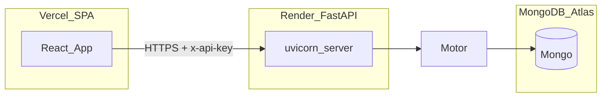

# Trace Analyst — audit, checklist, deployment roadmap, and fix execution plan

## 1. Current status assessment

### Core app logic

- **Working:** Full investigation lifecycle in [backend/server.py](backend/server.py): CRUD investigations, entities, relationships, evidence (with ingest URL/text/file, batch, merge, duplicates), timeline, AI suggestions CRUD, leads engine, chat history/clear, graph helpers (analyze/clusters/suspicious patterns), exports (JSON/CSV/Markdown), entity extraction/enrichment endpoints, evidence categories. Frontend maps API ↔ Zustand in [frontend/src/pages/InvestigationWorkspace.js](frontend/src/pages/InvestigationWorkspace.js); workspaces cover graph, entities, evidence, timeline, AI suggestions, leads, chat ([frontend/src/store/investigationStore.js](frontend/src/store/investigationStore.js)).
- **Partial:** `/api/osint/search` returns **mock** data (`MOCK_OSINT_DATA`), not live OSINT ([backend/server.py](backend/server.py) ~1718–1732). AI paths depend on `EMERGENT_LLM_KEY` and private `emergentintegrations`; without key, stub/placeholder behavior (CI installs a temp stub via [backend/tests/conftest.py](backend/tests/conftest.py)).
- **Broken / missing:** No real multi-tenant user auth; no org/case ACLs. Draft PR features (#3, #5 from your summary) are **not** in this workspace copy — treat as future scope.

### MongoDB data layer

- **Working:** Motor client, collections implied by usage; **indexes** created on startup in [backend/server.py](backend/server.py) (lines ~~3061–3076) for investigations, entities, relationships, timeline_events, evidence, ai_suggestions, investigation_leads, chat_messages. Cascade delete on investigation removal (~~1437+).
- **Partial:** No migration/versioning layer; `timeline` uses ISO strings in DB helpers — consistent with serializers elsewhere but mixed datetime handling in list handlers.
- **Missing:** Explicit schema validation in DB; backup/restore not codified.

### Authentication / authorization

- **Working:** Shared secret `API_KEY` ([backend/server.py](backend/server.py) ~48, ~65–68); axios default header in [frontend/src/config/api.js](frontend/src/config/api.js).
- **Critical gap:** API key is **embedded in the static frontend** (`REACT_APP_API_KEY` or default). Anyone can extract it — acceptable only for **internal/single-tenant** pilots behind VPN, not public production.
- **Weak consistency:** `GET /api/` does **not** call `validate_api_key` ([backend/server.py](backend/server.py) ~~1344–1346) while tests send the key anyway ([backend/tests/test_investigation_api.py](backend/tests/test_investigation_api.py)). `POST /api/auth/validate` returns **200** with `valid: false` for bad keys instead of 401 (~~1348–1352) — intentional per tests but non-idiomatic.

### API routes and error handling

- **Working:** Broad route coverage (grep shows ~35+ `api_router` handlers). `HTTPException` used for 404s on missing resources.
- **Partial:** Try/except around AI paths (needs reading deeper for edge cases); OCR/PDF/BS4 guarded by optional imports at top of [backend/server.py](backend/server.py).

### Frontend UI vs [design_guidelines.json](design_guidelines.json)

- **Aligned:** [frontend/tailwind.config.js](frontend/tailwind.config.js) tokens (background `#050505`, primary cyan, secondary amber, fonts Manrope/Rajdhani/JetBrains Mono). [frontend/src/index.css](frontend/src/index.css) root background and grid utility. Pages use default exports ([frontend/src/App.js](frontend/src/App.js), [Dashboard.js](frontend/src/pages/Dashboard.js), [InvestigationWorkspace.js](frontend/src/pages/InvestigationWorkspace.js)). Sonner toasts wired in `App.js`.
- **Deviations (concrete):**
  - **Shadcn Button** uses `rounded-md` and default variant styling — spec asks `rounded-sm` and cyber-styling ([frontend/src/components/ui/button.jsx](frontend/src/components/ui/button.jsx) ~7–27).
  - **Custom graph node** uses generic blue palette `#112240`, **rounded-full** “pill” node shape, `**transition-all`**, and default emoji `📍` ([frontend/src/components/CustomNode.js](frontend/src/components/CustomNode.js)) — conflicts with “square corners / cyan primary / no decorative emoji / avoid transition-all.”
  - `**transition-all`** also appears on multiple workspace cards/buttons (grep: EvidenceWorkspace, AIChatWorkspace, InvestigationWorkspace, Dashboard, EntitiesWorkspace, LeadsWorkspace, CustomNode).
  - `**rounded-full`** used for empty-state orbs and progress bars — guideline forbids **pill buttons**; circular **non-button** decorations are a gray area but still clash with “sharp/cyber” tone on main graph avatar.
  - `**data-testid`:** only **29** interactive/structural hooks across a subset of components; guideline requires **all** interactive elements — **Dashboard**, dialogs, **AIChatWorkspace**, many **Button**s lack `data-testid`.
  - **Spec self-contradiction:** `design_guidelines.json` `rules.donts` forbid pill buttons; `UNIVERSAL_GUIDELINES_FOR_MAIN_AGENT` line 158 mentions “pill-shaped” buttons — **treat `tokens.shapes` + `rules.donts` as authoritative** per your instructions.

### Environment and secrets

- **Working:** `python-dotenv` loads [backend/.env](backend/.env) when present; `CORS_ORIGINS` env for comma-separated allowlist ([backend/server.py](backend/server.py) ~3050–3056).
- **Missing in repo:** No committed `.env.example` files (search found none) — onboarding/deploy footgun.
- **Frontend:** `REACT_APP_BACKEND_URL` builds `API` in [frontend/src/config/api.js](frontend/src/config/api.js) with **no guard** if undefined → `"undefined/api"`.

### Error handling and logging

- **Working:** `logging` configured at INFO ([backend/server.py](backend/server.py) ~58–62). `logger` used in places (e.g. index creation).
- **Missing:** No request correlation IDs, no centralized error middleware, no metrics.

### Dependencies and package health

- [backend/requirements.txt](backend/requirements.txt): **FastAPI 0.110.1**, **starlette 0.37.2**, **pymongo 4.5.0**, **black 26.1.0**, **pyasn1 0.6.2** — your open PRs likely bump these; pins are **stale vs** stated targets (4.6.3 / 0.49.1 / 26.3.1).
- **Private/emergent:** `emergentintegrations` in requirements; CI strips it and uses stub ([.github/workflows/ci.yml](.github/workflows/ci.yml)). [frontend/package.json](frontend/package.json) includes `@emergentbase/visual-edits` tarball — **production `yarn install` depends on `assets.emergent.sh` availability** (Craco only wraps visual edits in **dev**; see [frontend/craco.config.js](frontend/craco.config.js) ~85–98).

### Build pipeline

- **Present:** [.github/workflows/ci.yml](.github/workflows/ci.yml) — Ubuntu, MongoDB apt install, pip install (minus emergent), **pytest only**. Sets `PYTHONPATH` for tests.
- **Missing:** `**yarn build`** (and optionally `yarn test`) for frontend in CI — regression risk for deploy.
- **Local:** AGENTS.md documents flake8, pytest, `yarn build`.

---

### Production readiness score (data-backed)

| Pillar                       | Score (0–100) | Evidence                                                                |
| ---------------------------- | ------------- | ----------------------------------------------------------------------- |
| Features / workflows         | **80**        | Broad CRUD + graph + evidence + exports + leads/chat; OSINT mocked      |
| Data / Mongo                 | **78**        | Startup indexes, cascade delete; no migrations                          |
| Security / auth              | **32**        | Static API key, `CORS_ORIGINS` default `*`, unauthenticated `GET /api/` |
| Frontend / design compliance | **58**        | Tailwind tokens good; Shadcn/CustomNode/transition-all/testid gaps      |
| Config / env safety          | **42**        | No `.env.example`; `BACKEND_URL` undefined risk                         |
| Observability                | **52**        | Basic logging only                                                      |
| CI / release                 | **45**        | Backend tests only; no frontend gate                                    |
| Deploy artifacts             | **22**        | No Dockerfile/render.yaml in repo                                       |

**Weighted overall (features 25%, security 25%, design 15%, config 10%, CI/deploy 25%): ~56%** — rounded to **56% production-ready** for a **public internet** deployment. For a **single-tenant internal** tool behind VPN with rotated keys and locked CORS, effective readiness rises toward **~68%** after CI + env hardening (same codebase, different threat model).

---

## 2. Debug checklist (prioritized)

| Severity     | Issue                                            | Location                                                                       | Fix                                                                                                                                                                                      |
| ------------ | ------------------------------------------------ | ------------------------------------------------------------------------------ | ---------------------------------------------------------------------------------------------------------------------------------------------------------------------------------------- |
| **Critical** | API key shipped in browser bundle                | [frontend/src/config/api.js](frontend/src/config/api.js)                       | **Default for this plan:** keep for pilot; document risk. **Real fix:** move privileged calls to a BFF or add user session + server-side proxy; never expose admin key in `REACT_APP_*`. |
| **Critical** | Missing `REACT_APP_BACKEND_URL` → broken API URL | [frontend/src/config/api.js](frontend/src/config/api.js)                       | Throw early in dev/build or `console.error` + fail CI if unset in production build.                                                                                                      |
| **High**     | CORS default `*` + `allow_credentials=True`      | [backend/server.py](backend/server.py) ~3050–3056                              | Set explicit `CORS_ORIGINS` in prod; avoid `*` when credentials used.                                                                                                                    |
| **High**     | No frontend CI                                   | [.github/workflows/ci.yml](.github/workflows/ci.yml)                           | Add job: `yarn install --frozen-lockfile`, `yarn build` with env vars.                                                                                                                   |
| **High**     | Graph nodes violate design + emoji default       | [frontend/src/components/CustomNode.js](frontend/src/components/CustomNode.js) | Restyle to `rounded-sm`, cyan/teal palette, Lucide icon from entity type; remove `transition-all` (use `transition-colors` / `transition-transform` selectively).                        |
| **Medium**   | Shadcn button radius/variants vs spec            | [frontend/src/components/ui/button.jsx](frontend/src/components/ui/button.jsx) | Switch base to `rounded-sm`, align variants with `design_guidelines.json` Button tokens.                                                                                                 |
| **Medium**   | `transition-all` on several components           | grep-listed files under `frontend/src`                                         | Replace with specific properties per UNIVERSAL guideline.                                                                                                                                |
| **Medium**   | Markdown export uses emoji severity markers      | [backend/server.py](backend/server.py) ~3023–3027                              | Replace with text labels (`[CRITICAL]` etc.) to align with “no emoji icons.”                                                                                                             |
| **Medium**   | `GET /api/` unauthenticated                      | [backend/server.py](backend/server.py) ~1344–1346                              | Either require API key for all routes **or** split **public** `/health` vs protected `/api/*` (single recommendation: **require key on `/api/`** and update tests).                      |
| **Medium**   | FastAPI `@app.on_event` startup/shutdown         | [backend/server.py](backend/server.py) ~3060–3080                              | Migrate to **lifespan** context (Starlette/FastAPI current best practice) when touching server bootstrap.                                                                                |
| **Low**      | No `.env.example`                                | repo root                                                                      | Add `backend/.env.example`, `frontend/.env.example` with required keys (no secrets).                                                                                                     |
| **Low**      | `App.css` CRA relic with generic blue link       | [frontend/src/App.css](frontend/src/App.css)                                   | Remove or align if ever imported (currently unused by [App.js](frontend/src/App.js)).                                                                                                    |
| **Low**      | Incomplete `data-testid` coverage                | Dashboard, AI chat, dialogs, etc.                                              | Add stable testids per guideline.                                                                                                                                                        |
| **Low**      | OSINT remains mock                               | [backend/server.py](backend/server.py) `/osint/search`                         | Either gate behind feature flag + document, or integrate real providers post-launch.                                                                                                     |

**Decision points (single recommendation each)**

| Decision                                                 | Recommendation                                                                                                                                                                                                                           |
| -------------------------------------------------------- | ---------------------------------------------------------------------------------------------------------------------------------------------------------------------------------------------------------------------------------------- |
| Draft feature PRs (#3, #5)                               | **Do not merge before first production deploy** — scope explosion; keep draft or close until MVP is stable; merge as **post-launch** vertical slices with separate QA.                                                                   |
| Dependency PRs (pymongo, starlette, black, pyasn1, yarn) | **Merge in one batch** after local + CI green: backend `pip install -r requirements.txt` + full pytest; frontend `yarn build`; address any Starlette middleware API changes. Prefer **one** consolidated PR to reduce integration churn. |
| `auth/validate` 200 vs 401                               | **Keep 200 + JSON body** for now to avoid breaking existing tests/clients; if you need strict REST, add **v2** validate endpoint — **business change**, not done silently.                                                               |
| Private Emergent tarball for frontend                    | **Short term:** keep; **if install flakes:** fork stub or vendor package into repo for supply-chain reliability.                                                                                                                         |

---

## 3. Deployment roadmap

### Done and solid

- Feature breadth of REST API and workspace tabs.
- Mongo index creation path.
- Backend CI with Mongo + pytest + emergent stub pattern.

### Partial — finish before public deploy

- CORS and secrets story.
- Frontend build in CI.
- Design-system cleanup on graph + shared Button.
- `.env.example` and build-time validation for `REACT_APP_BACKEND_URL`.

### Missing entirely

- IaC / Dockerfile in repo (search found **none**).
- Real OSINT/AI keys and production-grade auth.
- Monitoring/alerting.

### Ordered task sequence

**Must-fix before internet-facing deploy**

1. Set production `CORS_ORIGINS`, remove wildcard in prod.
2. Rotate `API_KEY`; document that browser exposure is a known limitation until BFF/auth exists.
3. Add frontend `yarn build` to CI with required env vars.
4. Guard `BACKEND_URL` / `API` construction.
5. Harden `GET /api/` (require key) **if** you accept a small test update.

**Post-launch**

- Real OSINT providers; optional merge of draft toolkit PR.
- User auth (e.g. OIDC) + server-side API access.
- Metrics, rate limiting, audit log.

### Infrastructure (single choices with reasoning)

| Area            | Choice                                                                         | Reasoning                                                                                                                                                    |
| --------------- | ------------------------------------------------------------------------------ | ------------------------------------------------------------------------------------------------------------------------------------------------------------ |
| MongoDB         | **MongoDB Atlas**                                                              | Managed backups, TLS, scaling; avoids self-hosting `mongod` on PaaS disk; fits Motor connection string as-is.                                                |
| Backend hosting | **Render Web Service**                                                         | Native Python/`uvicorn` support, simple env var UI, good fit for FastAPI without maintaining Docker (optional Docker later); predictable for small teams.    |
| Frontend        | **Vercel**                                                                     | Strong CRA/static SPA story, preview envs per PR, easy `REACT_APP_`* injection — you asked Vercel vs Netlify; **Vercel** edges ahead for PR previews and DX. |
| CI/CD           | **GitHub Actions** (extend existing)                                           | Already in [.github/workflows/ci.yml](.github/workflows/ci.yml); add frontend job + optional deploy hooks.                                                   |
| Env vars        | **Render + Vercel dashboards** + **GitHub Secrets** for CI                     | No new secret store product; sync keys manually or script once.                                                                                              |
| CORS            | **Explicit origin list** in `CORS_ORIGINS` matching Vercel prod + preview URLs | Required for split deployment; `*` unsafe with credentials.                                                                                                  |
| Domain / SSL    | **Vercel + Render default HTTPS**; CNAME apex/subdomain to each                | Let platforms manage certs (ACM/Let’s Encrypt under the hood).                                                                                               |

### PR triage (8 open — pattern-based; verify numbers on GitHub)

- **Transitive dependency / security bumps (pymongo, starlette, pyasn1, black, npm/yarn):** **Merge after** full pytest + `yarn build` — treat as **pre-deploy** if CVE-related; else **post-deploy** if only hygiene — your listed versions suggest **pre-deploy** for Starlette/pymongo.
- **Draft “OSINT toolkit” / “AI engine”:** **Do not merge for MVP** — **post-launch** or **close** if superseded by repo direction.

---

## 4. Execute fixes (post-approval implementation order)

Plan mode blocks edits until you confirm. Proposed execution sequence:

1. **CI:** Add `frontend-build` job to [.github/workflows/ci.yml](.github/workflows/ci.yml) (`working-directory: frontend`, `yarn install --frozen-lockfile`, `yarn build` with `REACT_APP_BACKEND_URL=https://example.com` dummy + `REACT_APP_API_KEY=dummy`).
2. **Frontend config:** Validate `REACT_APP_BACKEND_URL` in [frontend/src/config/api.js](frontend/src/config/api.js); fail fast in production builds (use `process.env.NODE_ENV === 'production'`).
3. **Backend:** Tighten CORS documentation in AGENTS/README; optionally require API key on `GET /api/` and adjust [backend/tests/test_investigation_api.py](backend/tests/test_investigation_api.py).
4. **Backend:** Remove emoji from Markdown export in [backend/server.py](backend/server.py).
5. **Frontend:** Refactor [frontend/src/components/CustomNode.js](frontend/src/components/CustomNode.js) to guideline shapes/colors/icons; eliminate `transition-all`.
6. **Frontend:** Update [frontend/src/components/ui/button.jsx](frontend/src/components/ui/button.jsx) to `rounded-sm` and guideline-aligned variants.
7. **Frontend:** Sweep high-traffic `transition-all` usages to specific transitions.
8. **Repo:** Add `backend/.env.example` and `frontend/.env.example`.
9. **Optional same-sprint:** Lifespan migration for Mongo startup/shutdown in [backend/server.py](backend/server.py).

**Dependencies:** CI job (1) depends on api.js guard (2) if build must succeed with strict checks; CORS (3) is independent; design fixes (5–7) are independent of backend.

---

